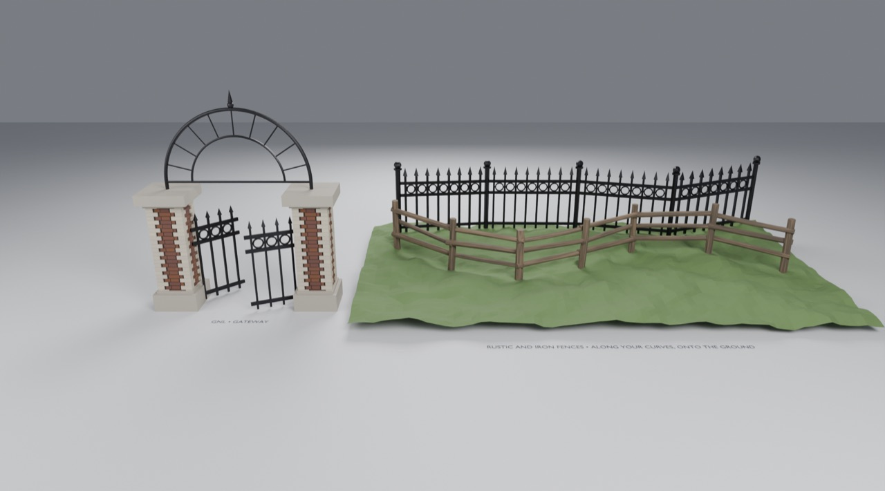

# Use the Fences in Blender

Open `gallery.blend`, made by appending from `assets/Fences.blend` into a fresh project.
Contract and mechanics: [generators/fences](../../generators/fences/README.md).

1. **Reshape a fence:** click **Rustic path • edit me** or **Iron path • edit me** in the Outliner, press
   `Tab` over the 3D view and drag points. Posts re-space and re-seat on the hill.
2. **GNL • Rustic Fence** (wrench tab): **Rails → Rail Count**, **Path → Bay Length**, then open **Decay**.
3. **GNL • Iron Fence:** **Path → Follow Slope** (raked or stepped), **Panels → Rings**, **Decay → Derelict Panels**.
4. **GNL • Gateway:** **Gates → Swing Left / Right**, **Overthrow → Infill / Crown / Ivy**, and **Ruin**.

## Your own scene

**File → Append** → `assets/Fences.blend` → **Object** → a fence or the gateway. On a fence, set
**Path → Path** to any curve object (draw one with `Shift A` → Curve), and **Ground** to a terrain mesh.
