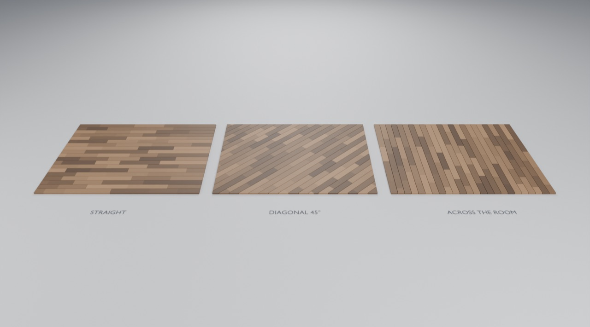

# Use the Floors in Blender

Open `gallery.blend` to explore the saved floor. This scene was created by
appending the exported asset into a fresh project; no production builder is needed
to use its controls. Source of truth for this example is the production builder
at `generators/floors/build.py`.

## Try the controls

1. Select **GNL • Hardwood Floor** in the viewport or Outliner (upper right).
2. Open Properties → **Modifiers**, the wrench icon on the right.
3. Expand **Room**, then change **Rotation** from 45° to 0° or 30°.
4. Expand **Laying** and change **Layout Seed**. The joint pattern regenerates.
5. Expand **Appearance** and change Color Seed or Color A/B. Boards stay in place.
6. Expand **Boards** and try a different board width or length range.

The Geometry Nodes workspace shows the public group. Select its construction
node and press Tab to enter it; Tab returns. The internal **Floor Laying** node
contains the repeat loop that chooses board positions. The per-element zone
builds and cuts each board independently, then combines them into one object.

## Add the floor to your own scene

Keep your own project open:

1. Choose **File → Append**.
2. Browse to `assets/Floors.blend` in this repository.
3. Open **Object**, select **GNL • Hardwood Floor**, and click **Append**.
4. Select the appended object and use its modifier controls.

Unlike the flask, this floor also works as a standalone node-group generator.
Append **NodeTree → GNL • Hardwood Floor**, then assign it in a Geometry Nodes
modifier on any mesh object. It replaces the host geometry. The object-append
route simply gives you a ready-made host with sensible defaults.

If the `assets` folder is configured as an Asset Library, choose **Append** as the import
method. Drag the floor **object** into the viewport, or apply the floor **node
group** to a mesh. Both public entries are intentionally provided.

You can combine the floor with flasks, windows, furniture and other assets in one
consumer scene. Duplicate a floor with Shift+D for independent modifier values;
the duplicates can share the underlying recipe. Editing the shared graph changes
all its users. File → Save As preserves your project independently of the library.

**Light Oak:** set Color A to `#b99569` and Color B to `#dfc398` using Blender's
color picker Hex field. Warm Brown uses `#493729` and `#93714f`.

The floor has an open room perimeter but each individual board is a closed solid.
Top surface is at Z=0. Tiny wall-end pieces are absorbed into a retained board in
the same row; pieces without such a neighbor can still be removed. The floor is
planed timber with per-board color; it has no weathering or bevel. See the
[production guide](../../generators/floors/README.md) for limits, UVs,
readout sockets and the source-interface mapping.
