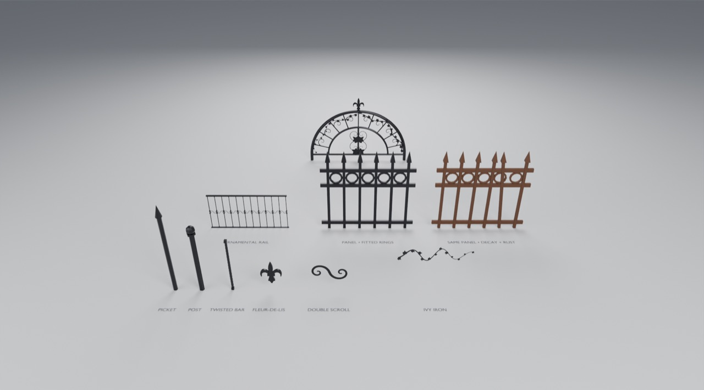

# Use the Ironwork members in Blender

Open `gallery.blend`. It was made by appending from `assets/Ironwork.blend` into a fresh project.
Contract and mechanics: [generators/ironwork](../../generators/ironwork/README.md).

## Try it

1. Click **GNL • Panel** (front right) and open the **wrench tab**.
   - **Run → Length** or **Gap**: the picket count re-resolves.
   - **Rings → Rings** on: rings fit every opening and follow the pitch.
   - **Decay → Missing / Bent Pickets**, then **Decay Seed** for a different ruin of the same panel.
2. The rusted panel behind is a **copy** of the same object with rings, decay and the
   *GNL • Iron • Rusted* material. Copies share the node group and differ only in modifier values.
3. **GNL • Scroll**: **Spiral → Turns**, **Tightness**, **Flip**; **Bar → Taper**.
4. **GNL • Picket**: **Finial** Spear / Ball / None, and **Sides** 4 for square tubing.

## Add to your own scene

**File → Append** → `assets/Ironwork.blend` → **Object** (ready-made), **NodeTree** (to compose
your own graphs, e.g. instancing pickets along a curve) or **Material**.
