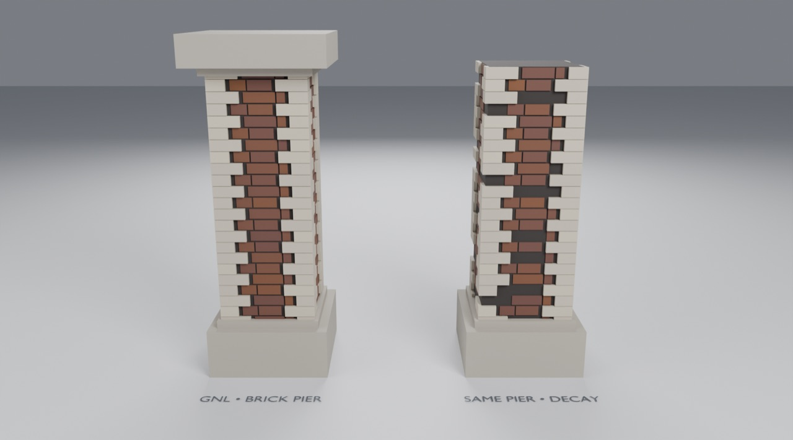

# Use the Brick Pier in Blender

Open `gallery.blend`, made by appending from `assets/Masonry.blend` into a fresh project.
Contract and mechanics: [generators/masonry](../../generators/masonry/README.md).

1. Click **GNL • Brick Pier** and open the **wrench tab**. Drag **Shaft → Height**: the courses re-fit.
2. **Bricks → Brick Length** and **Mortar**: watch the closers at each course end change.
3. The right pier is a copy with **Decay** turned up: missing bricks and quoins, and a fallen cap.

To use it in your own scene: **File → Append** → `assets/Masonry.blend` → **Object → GNL • Brick Pier**
(or **NodeTree** to build it into your own graph, using its **Top** output to seat things on it).
