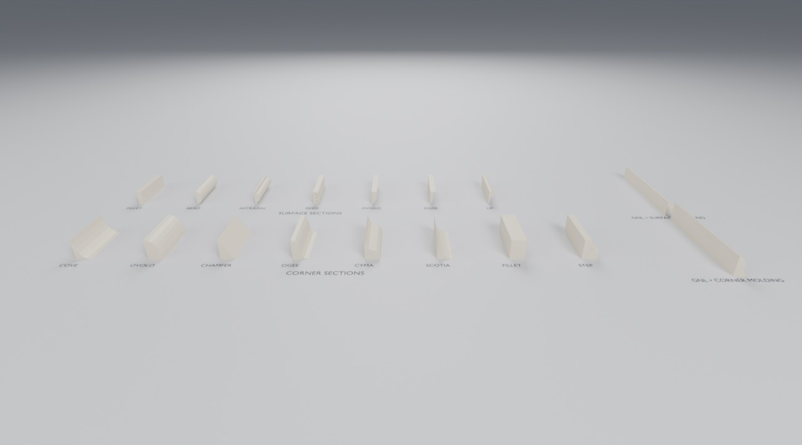
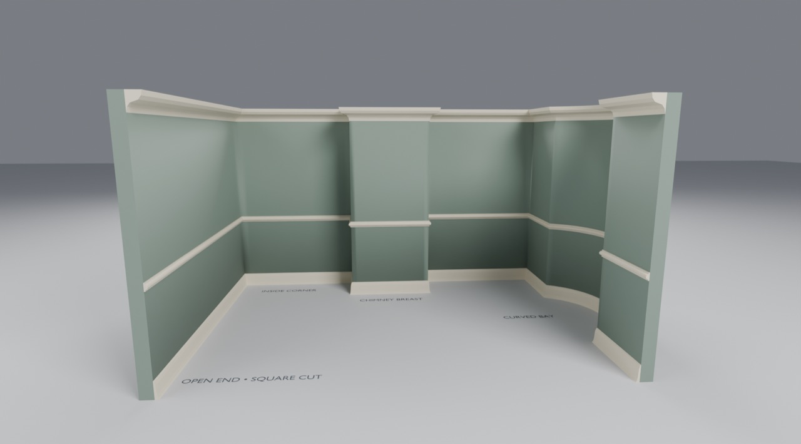

# Use the Molding in Blender

Open `gallery.blend`: every named section as a short piece facing you end-on, with corner sections in the
front row and surface sections behind. On the right are the two objects themselves:

- **GNL • Corner Molding**: eight solid-backed corner profiles. Crown hangs downward from its origin; turn
  Crown off for base molding that rises upward.
- **GNL • Surface Molding**: seven profiles with one flat supporting back.

Select a piece, then Properties → **Modifiers** (wrench). Change **Profile**,
**Length**, **Height**, **Projection** and **Segments**. Surface Reed also exposes
Reeds and Reed Backing. Material is replaceable. Both remain editable after append;
no Python is needed to evaluate them.

Length follows local X, centered at the origin. The back lies on Y=0 and the front
projects toward −Y. Height follows +Z for surface/base or −Z for crown. Place the
object origin at the wall/floor or wall/ceiling line, then move/rotate the object.
Keep object scale at 1 when you want the controls to represent physical dimensions.

**Adding one piece:** File → Append → `assets/Molding.blend` → Object → **GNL • Corner Molding** or
**GNL • Surface Molding**. The file also holds the standalone modifier groups and the reusable profile
groups (NodeTree → **GNL • Corner Molding Profile** / **Surface Molding Profile**), whose output curve can
be a sweep profile in your own graph.

The gallery's corner samples are all bases, so both rows rise the same way.

These straight pieces have square ends. For molding that follows walls and turns corners, use
**Molding Run** (below). Reed uses a small backing to keep the beads connected, unlike the SDK's
zero-thickness valleys. See the [family README](../../generators/molding/README.md).

## The room

Open `room.blend`: one room plan with a crown, a chair rail and a base running continuously around it.
It shows every kind of joint:

- **Inside corners** at the back of the room.
- **A chimney breast**: two inside corners where it meets the wall, two outside corners at its front.
- **A curved bay**: a true circular arc, so the molding curves with it.
- **Open ends**: square cuts where each run stops at the front of the room. A joiner would *return*
  them to the wall; see [Next: ends](../../generators/molding/README.md#next-ends-and-other-molding-studies).

**Change the room:** the three objects named *… path • edit the room plan* are **linked duplicates**:
three objects at three heights (0, 0.9 and 2.4) sharing one curve. Select any of them, press **Tab**,
and move its points or Bézier handles: the walls and all three moldings follow. Press **Tab** again to
leave Edit Mode.

**Change a molding:** select *Molding Run • Crown* (or Chair Rail, or Base), then the **Modifier** tab
(wrench). Try another **Corner Profile**, a bigger **Projection**, or **Run**. The walls are scene dressing
for this example, not an asset, but look inside their small *Room walls • example only* group: they are
**Molding Run again**, with a plain rectangle as the section, projected outward. That gives them real
thickness and the same exact corners.

**Your own run:** File → Append → `assets/Molding.blend` → Object → **GNL • Molding Run**. Until you set
**Path**, it shows a sample 4 × 3 room. Draw a curve (Add → Curve), set it as **Path**, and choose a
**Run**. Draw a room **anticlockwise** seen from above, so the molding faces into it, or turn on
**Outward**.
