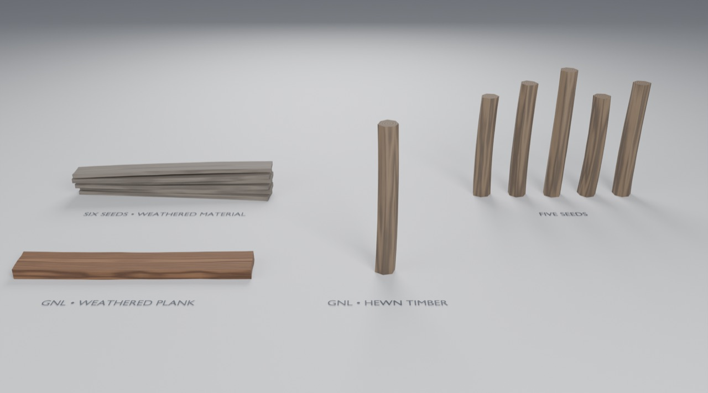

# Use the Timber members in Blender

Open `gallery.blend`. It was made by appending from `assets/Timber.blend` into a fresh project.
How the members work: [generators/timber](../../generators/timber/README.md#how-it-works).

## Try it

1. Click **GNL • Weathered Plank** (front left) and open the **wrench tab**.
2. Change **Variation → Seed** for a new board. Open **Warp**, turn **Randomize Warp** off, then
   drag **Bow**, **Crook**, **Cup** or **Twist** to see each one exactly.
3. Below the node modifier, the **Worn edges (Bevel)** modifier rounds the arrises. Toggle it with
   its monitor icon.
4. Click **GNL • Hewn Timber** and try **Facets** 5–8, **Facet Variation** and **Twist**.

The stacked planks and the rank of logs are copies of the same objects with different seeds. Copies
share the node group, and only the modifier values differ.

## Add to your own scene

**File → Append** → `assets/Timber.blend` →
- **Object** → *GNL • Weathered Plank* or *GNL • Hewn Timber*, ready to use; or
- **NodeTree** → the member groups, to use inside your own graph (e.g. instance logs along a curve);
- **Material** → a wood material for anything carrying a `grain` attribute.
