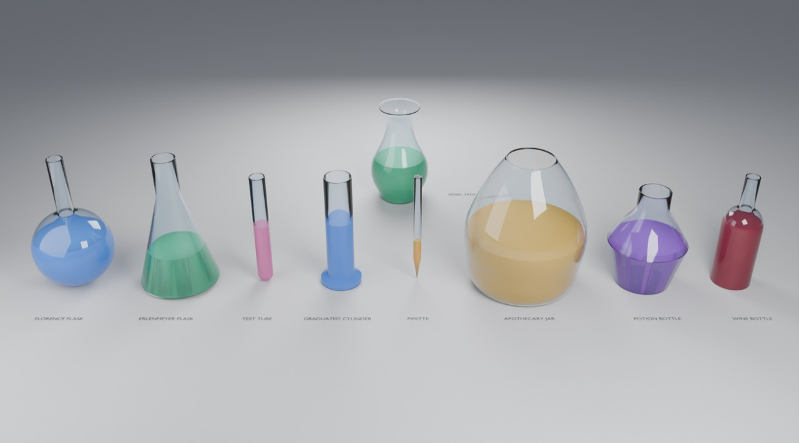

# Use the Vessels in Blender

Open `gallery.blend` to explore. This scene was made by appending from
`assets/Vessels.blend` into a fresh project, the same way you would add them to your own.
No Python runs when you change anything. The source of truth is `generators/vessels/build.py`.

For how each control works inside the graph (Catmull-Rom smoothing, offsets, the lathe), read
[How it works](../../generators/vessels/README.md#how-it-works) and
[Curves](../../docs/concepts/curves.md).

## Try the controls

1. Click a vessel, e.g. the **Potion Bottle**. You can also click its name in the Outliner (top right).
2. In the Properties panel (bottom right), open the **wrench (Modifier) tab**.
3. The controls are grouped into collapsible panels:
   - **Shape**: this vessel's own dimensions, the same parameters as the three-low-poly function
   - **Silhouette**: *Smooth Silhouette* rounds the profile through its points (try it on the Potion Bottle)
   - **Glass**: wall *Thickness* (0 = single surface with a rolled rim), rim style, glass material
   - **Liquid**: *Fill* level, gap to the glass, liquid material, or turn the liquid off
   - **Detail** (collapsed): facets around the axis and the smoothing angle

The viewport uses Material Preview (EEVEE), lit by the scene's own world and lights. For the
true glass look, as in the preview above, press `Z` over the 3D view and choose **Rendered**
(Cycles). On Apple Silicon, select **Metal** in Preferences → System → Cycles Render Devices, and
set Render Properties → Device to **GPU Compute**.

## Draw your own vessel

The vessel at the back is **GNL • Vessel From Curve**, fed by the Bézier curve
**GNL • Vase Profile**, which is parented to it so the two move together.

1. Click **GNL • Vase Profile** in the Outliner. It's listed under the vessel; expand the vessel's row if needed.
2. Move the mouse over the 3D view and press `Tab` (Edit Mode).
3. Drag a point or a handle. The glass, wall and liquid follow live. Press `Tab` to finish.

Draw the curve in the object's **X–Z plane** (front view: numpad `1`). X is the radius, Z is
the height, and the first point should sit on the axis (X = 0) at the base.

## Add vessels to your own scene

With your own project open:

1. **File → Append**.
2. Browse to `assets/Vessels.blend` in this repository, then open **Object**.
3. Select one or more of **GNL • Florence Flask … GNL • Wine Bottle** and click **Append**.
4. Select the new object and use its wrench-tab controls.

For your own curve, also append **GNL • Vessel From Curve** (and optionally **GNL • Vase Profile**).
On the vessel, set **Shape → Profile Curve** with the eyedropper or dropdown.

If you've added the `assets` folder as an Asset Library (Preferences → File Paths →
Asset Libraries), the same items appear in the Asset Browser under **GeoNodes Lab → Vessels**. Set the
import method to **Append** and drag them in.

### Building your own graphs

Append from **NodeTree** instead to use the building blocks inside your own Geometry Nodes graph:

| Node group | Use it for |
| --- | --- |
| **GNL • Vessel** | Any silhouette curve in → Geometry, Glass, Liquid, Glass Section, Liquid Section out |
| **GNL • Silhouette • …** (8) | The named outer walls as curves (X = radius, Z = height) |
| **GNL • Vessel Shell** | Silhouette → closed double-wall section, or single surface + rolled rim |
| **GNL • Liquid Fill** | Silhouette → liquid section at a fill level |
| **GNL • Lathe** | Spin any XZ profile around Z, with welded poles, a `UVMap` and smoothing by angle |

Add one in the node editor with `Shift A` → Group, or drag it from the Asset Browser. To use a curve
object in your graph, connect **Object Info → Geometry** to *Silhouette* (or *Profile*).
