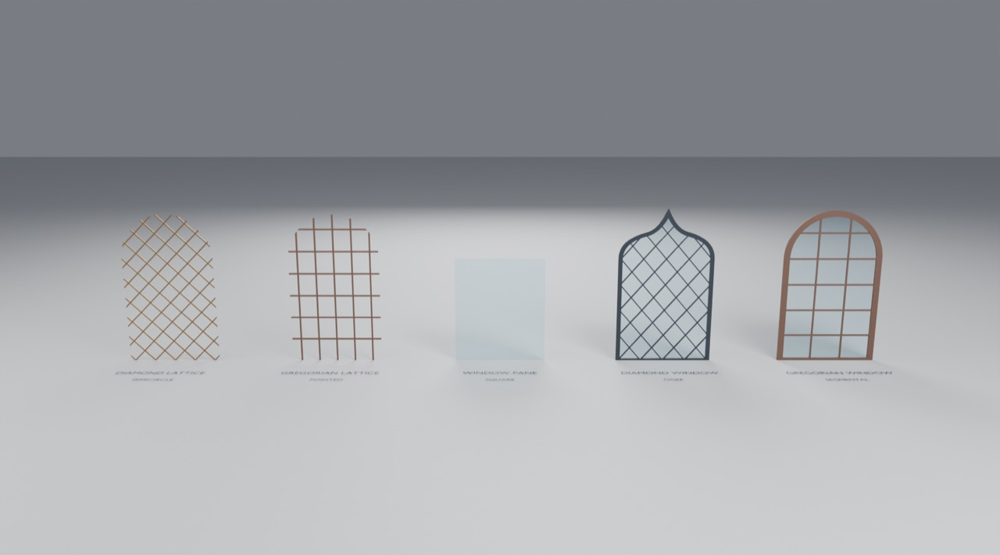

# Use the Windows in Blender

Open `gallery.blend`, made by appending from `assets/Windows.blend` into a fresh project. Each of the five
objects shows a different arch style. Contract and mechanics: [generators/windows](../../generators/windows/README.md).

## Try it

1. Click any window and open the **wrench (Modifier) tab**.
2. **Opening → Arch Style**: Square, Semicircle, Segmental, Horseshoe, Elliptical, Pointed or Ogee. Then
   **Width**, **Springing Height** and **Rise**. The pattern, glass and frame re-fit together.
3. **Diamond Lattice / Window → Pattern**: the came angle, spacing and phase, or (for windows) the number of
   cells across and up.
4. **Gregorian Lattice / Window**: independent mullion and transom spacing, or lights across and up.
5. **Window Pane**: switch between a single surface and a thin solid slab. The glass always fits the opening exactly.
6. **Diamond / Gregorian Window → Components**: toggle the frame and glass, and adjust the frame inset and outset.

## Add to your own scene

**File → Append** → `assets/Windows.blend` → **Object** → any of the five. For your own graphs, append
**NodeTree → GNL • Opening Profile**. Its *Outline*, *Region* and *Cutter* outputs give you an opening's
boundary curve, its filled face, and a closed solid for cutting the hole in a wall with a **Boolean** modifier.
